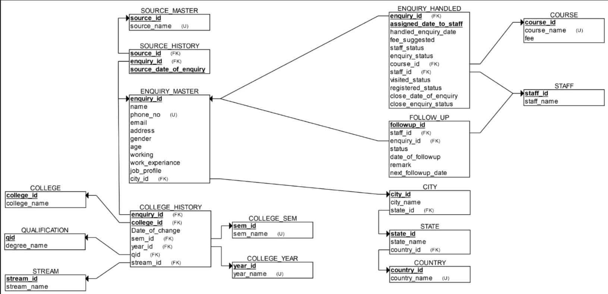

# Education CRM & Admission Enquiry Management System

## Project Description
Designed and implemented a normalized relational database system for managing student enquiries, admission processes, lead sources, follow-ups, staff assignments, and academic history using Oracle SQL, primary keys, foreign keys, and SQL queries.

---

## Features
- Student enquiry management
- Admission process tracking
- Follow-up management
- Staff assignment system
- Lead source tracking
- Academic history management
- Course management
- Relational database design

---

## Technologies Used
- Oracle SQL
- SQL Developer
- Relational Database Management System (RDBMS)

---

## Database Concepts Used
- Primary Keys
- Foreign Keys
- Database Normalization
- SQL Joins
- Aggregate Functions
- Constraints
- Relational Modeling

---

## Database Tables
- enquiry_master
- enquiry_handled
- follow_up
- course
- staff
- college_history
- city
- state
- country

---

## ER Diagram

---

## Files Included
- create_tables.sql
- insert_data.sql
- queries.sql
- ER_Diagram.png

---

## Author
Ghanshyam Nagpure